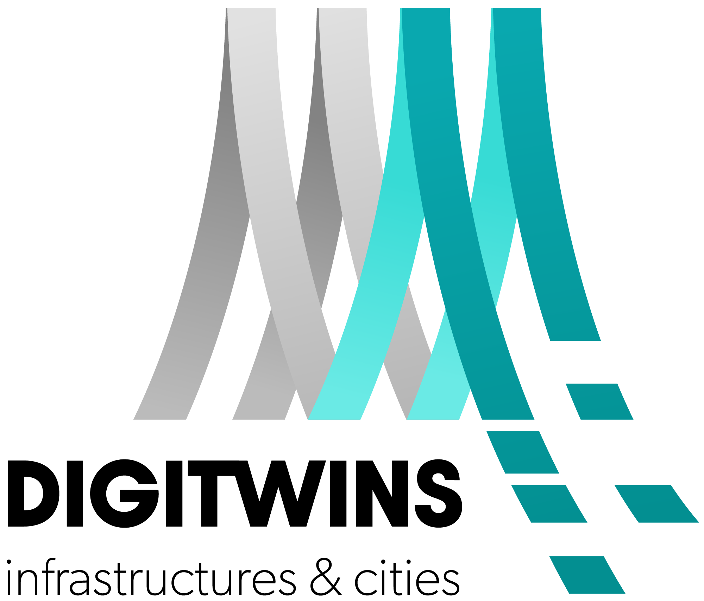

# Antrobot Description Package  

The **antrobot_description** package provides the URDF/Xacro files, 3D models, and configuration files necessary to define the **Antrobot** mobile robot platform. It ensures an accurate kinematic and dynamic representation for both **simulation** and **real-world deployment** within the **ROS 2** ecosystem. This package is essential for developing **digital twins**, enabling real-time monitoring, predictive maintenance, and simulation-based testing before deploying to physical hardware.  

## Features  

- **URDF/Xacro-based** modular robot description  
- **3D meshes and textures** for realistic visualization  
- **Gazebo compatibility** for physics-based simulation  
- **RViz integration** for robot model visualization and monitoring  
- **TF configuration** for proper coordinate frame management  
- **Sensor and actuator definitions** for accurate robot behavior  

## Acknowledgement

    
    This work was partially supported by the <a href="https://www.digitwin4ciue.eu/">DIGITWIN4CIUE</a> project of the European Union’s Digital Europe Programme under grant agreement No. 101084054.

